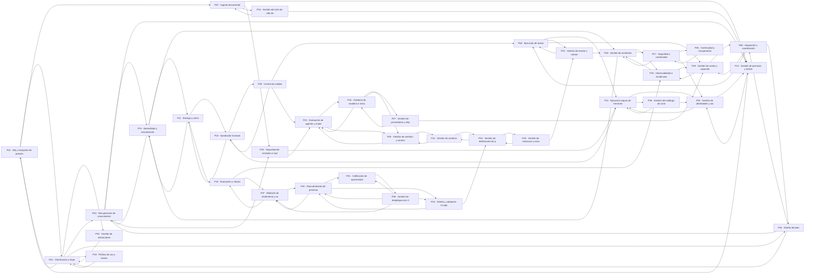

<!-- Generado por tools/org_gen.py desde tools/org_data/. No editar a mano. -->
# Dependencias entre procesos

Una flecha de A a B significa que A usa o activa B.

```mermaid
flowchart LR
  P01["P01 · Alta y recepción de petición"]
  P02["P02 · Clasificación y triaje"]
  P03["P03 · Gestión de aclaraciones"]
  P04["P04 · Recuperación de conocimiento"]
  P05["P05 · Diseño del plan"]
  P06["P06 · Asignación y coordinación"]
  P07["P07 · Ingesta documental"]
  P08["P08 · Ejecución de tareas"]
  P09["P09 · Control de calidad"]
  P10["P10 · Aprobación humana"]
  P11["P11 · Entrega y cierre"]
  P12["P12 · Gestión de cambios"]
  P13["P13 · Aprendizaje y actualización "]
  P14["P14 · Gestión de permisos y aislam"]
  P15["P15 · Observabilidad e incidencias"]
  P16["P16 · Gobierno de modelos e instru"]
  P17["P17 · Seguridad y continuidad"]
  P18["P18 · Evaluación y mejora"]
  P19["P19 · Política de uso y límites"]
  P20["P20 · Seguridad de entradas e inye"]
  P21["P21 · Ejecución segura de herramie"]
  P22["P22 · Gestión de errores y reinten"]
  P23["P23 · Evaluación de agentes y mode"]
  P24["P24 · Gestión del ciclo de vida de"]
  P25["P25 · Gestión de cambios y version"]
  P26["P26 · Continuidad y recuperación"]
  P27["P27 · Gestión de proveedores y dep"]
  P28["P28 · Gestión de incidentes"]
  P29["P29 · Gestión de costes y capacida"]
  P30["P30 · Gestión de identidades y sec"]
  P31["P31 · Calificación de oportunidad"]
  P32["P32 · Descubrimiento de procesos"]
  P33["P33 · Diseño y validación TO-BE"]
  P34["P34 · Gestión de definiciones de p"]
  P35["P35 · Gestión de instancias y exce"]
  P36["P36 · Gestión del catálogo de cone"]
  P37["P37 · Medición de rendimiento y va"]
  P38["P38 · Gestión de despliegue por cl"]
  P01 --> P02
  P01 --> P07
  P01 --> P14
  P02 --> P01
  P02 --> P03
  P02 --> P04
  P02 --> P05
  P02 --> P19
  P03 --> P02
  P04 --> P13
  P04 --> P14
  P04 --> P20
  P05 --> P02
  P05 --> P04
  P05 --> P06
  P06 --> P05
  P06 --> P08
  P06 --> P29
  P07 --> P14
  P07 --> P20
  P07 --> P24
  P08 --> P21
  P08 --> P22
  P08 --> P29
  P09 --> P08
  P09 --> P10
  P09 --> P23
  P10 --> P09
  P10 --> P11
  P11 --> P10
  P11 --> P13
  P11 --> P18
  P12 --> P25
  P12 --> P34
  P13 --> P04
  P13 --> P11
  P13 --> P28
  P14 --> P30
  P15 --> P28
  P15 --> P29
  P16 --> P23
  P16 --> P25
  P16 --> P27
  P17 --> P26
  P17 --> P28
  P17 --> P30
  P18 --> P15
  P18 --> P37
  P19 --> P02
  P20 --> P21
  P20 --> P23
  P21 --> P10
  P21 --> P30
  P21 --> P36
  P22 --> P08
  P22 --> P28
  P23 --> P16
  P23 --> P25
  P24 --> P07
  P24 --> P14
  P25 --> P12
  P25 --> P23
  P26 --> P17
  P27 --> P16
  P27 --> P29
  P28 --> P15
  P28 --> P17
  P28 --> P13
  P29 --> P06
  P29 --> P15
  P30 --> P14
  P30 --> P21
  P31 --> P38
  P32 --> P31
  P32 --> P33
  P32 --> P37
  P33 --> P32
  P33 --> P34
  P34 --> P12
  P34 --> P35
  P35 --> P22
  P35 --> P34
  P36 --> P21
  P36 --> P30
  P37 --> P18
  P37 --> P32
  P38 --> P31
  P38 --> P32
  P38 --> P33
  P38 --> P37
```
